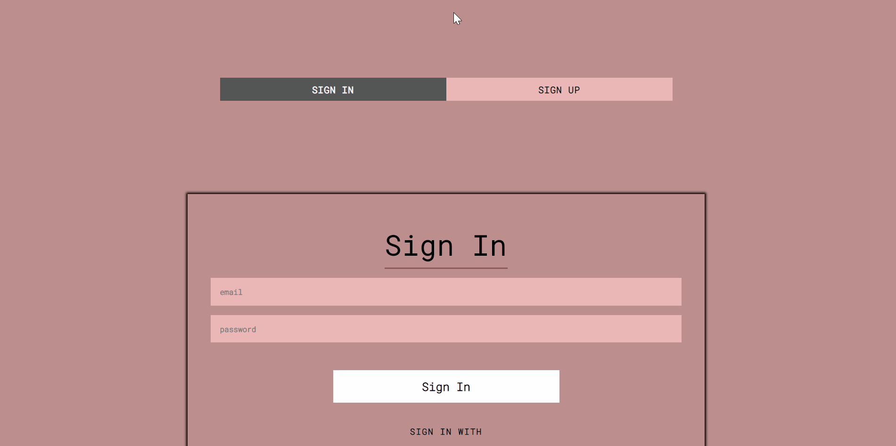

# BLOG POST PAGE 

### FEEL FREE TO CHECK IT OUT : [BLOGGING](https://blogging-966a7.web.app/)

### TECH USED 
    1. NODEJS+EXPRESS
    2. REACT
    3. FIREBASE PLATFORM

### SETUP 
    1. Clone this repository on your computer and open it.
    2. Run `cd blog-post` to get inside the folder.
    3. Run `npm install` to install all required dependencies.
    4. Start the app with `npm start`.
        *Defualt: Running on PORT 8080 using BUILD folder.
    5. Go to http://localhost:8080/.

### ENJOY !

 
